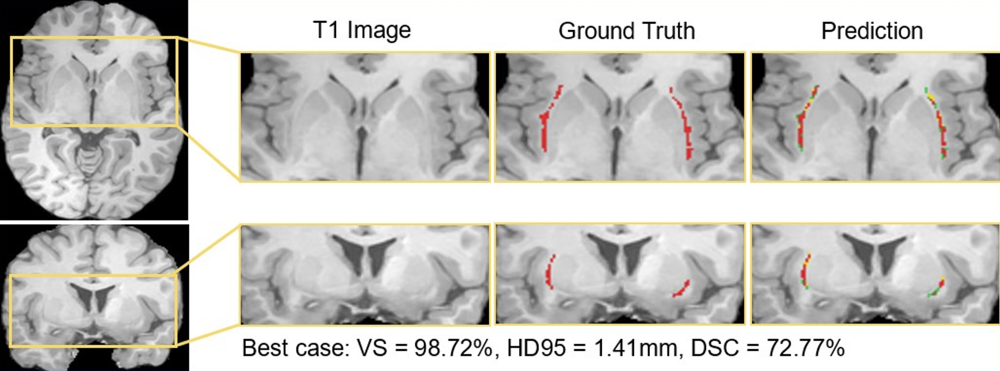

## A tutorial on automatic segmentation of the human claustrum in adult and neonatal brain MR images using deep learning. 

### How to directly apply it on your own dataset with our pre-trained models?
We provide two kinds of **pre-trained** models for automated segmentation of human adult [[1]](#1) and neonate claustrum [[2]](#2) in T1-w and T2-w images, respectively.
The adult model is trained on 181 T1-w scans of our in-house data while the neonatal one is trained on only 20 T2-w scans of the Developing Human Connectome Project ([DHCP](http://www.developingconnectome.org/)) with transfer learning from the adult model and yield comparable performance. You could directly perform inference for your new datasets.  

### Adult MRI
Here is a [simple demo](https://drive.google.com/file/d/1b0XS8LjRM-rZMPOL8qM6voG-A5jcdUgK/view?usp=sharing) to test on new T1-w scans. We use a public dataset from [ABIDE](http://fcon_1000.projects.nitrc.org/indi/abide/). Basically, the codes take 3D T1-w scans as the input and give you a 3D segmentation mask. The demo can run without GPUs and it takes around 90 seconds for one scan with CPU computation. The detailed instructions are in **ReadMe** inside. Please have a look at it. 
There are several **necessary** pre-processing steps you will need to follow before you feed your data to our pre-trained model: 

a) **Resampling** the MR scans to 1 mm³; This is because we trained the model on this kind of resolution. We provide the python codes for resampling in the repository. 
b) **Skull-stripping**; We tried two options: i) [ROBEX](https://www.nitrc.org/projects/robex), or ii) FSL-BET. All works well. We provide a simple bash file to use FSL-BET to deal with a couple of images in a loop. 
c) **Image denoising** using an adaptive nonlocal means filter for 3D MRI ([ANLM, in Matlab](https://sites.google.com/site/pierrickcoupe/softwares/denoising-for-medical-imaging/mri-denoising)). Unfortunately, we did not find the python version for this step. The default setting in Matlab was used in our work. 

After these three steps, you could play around with the test codes. Further background information and experiments are described in Li et al. [[1]](#1). Feel free to ask [me](http://campar.in.tum.de/Main/HongweiLi) any questions.  

### Neonatal MRI
The neonatal model is based on T2-w neonatal brain MRI of the Developing Human Connectome Project ([DHCP](http://www.developingconnectome.org/)). Image data can be requested on the project's [website](http://www.developingconnectome.org/data-release/second-data-release/information-registration-and-download/). Images were acquired by the DHCP with a 3T Philips Achieva; image resolution/voxel size: 0.5x0.5x0.5mm³; for details of acquisition and preprocessing see Hughes et al. [[3]](#3) and Makropoulos et al. [[4]](#4). Experimental details and specific challenges in neonates are described in Neubauer et al. [[2]](#2). The multi-view models can be found [here](https://drive.google.com/drive/folders/1XNBUx-yNbMpQYEtSz5SML1i1C_EeMRM4?usp=sharing). 
To apply a multi-view model, store three axial and three coronal models in the [models](./models/) folder. Then, save a preprocessed T2-w neonatal brain MRI in the [test](./data/test/) folder in a subfolder named after the subject-ID (subject-ID/subject-ID_sMRI_denoised.nii.gz). If your image has a divergent naming style or format, you will have to adjust the line below the comment *#read data* in [test_two_views.py](./test_two_views.py). Subsequently, you can run the code [test_two_views.py](./test_two_views.py). The claustrum segmentation will be saved in the [output](./output/) folder.
  

### How to train your own models
a) **Data preparation.** Resampling is not necessary if you want to work on the resolution you prefer. Save your prepared images and corresponding labels in [data/training/](./data/training/). 
b) **Install the requirements**, e.g. by: pip install -r requirements.txt 
c) **Training:** run the code [train_model.py](./train_model.py) with modified hyperparameters (epoch_count, img_shape, batch_size, model_number, orientation, transfer-learning or non-transfer learning) 
d) **Output:** the model weights will be saved in [saved_models/](./saved_models/), the csv_logger in [scores/](./scores/) 
e) **Testing:** Your own models or provided models can be tested with [test_model.py](./test_model.py)  

### Disclaimer on Datasets
We do not host or distribute [ABIDE](http://fcon_1000.projects.nitrc.org/indi/abide/) and [DHCP](http://www.developingconnectome.org/) data or claim that you have license to use these datasets. It is your responsibility to determine whether you have permission to use the datasets under the datasets' license.

### Acknowledgement
Neonatal data were provided by the developing Human Connectome Project, KCL-Imperial-Oxford Consortium funded by the European Research Council under the European Union Seventh Framework Programme (FP/2007-2013) / ERC Grant Agreement no. (319456). We are grateful to the families who generously supported this trial.

### References
<a id="1">[1]</a> Li, H., Menegaux, A., Schmitz-Koep, B., Neubauer, A., Bäuerlein, F.J.B., Shit, S., Sorg, C., Menze, B.,
Hedderich, D., 2021. Automated claustrum segmentation in human brain MRI using deep
learning. Hum. Brain Mapp. 42, 5862–5872. https://doi.org/10.1002/hbm.25655 
<a id="2">[2]</a> Neubauer, A., Li, H.B., Wendt, J., Schmitz-Koep, B., Menegaux, A., Schinz, D., Menze, B., Zimmer,
C., Sorg, C., Hedderich, D.M., 2022. Efficient Claustrum Segmentation in T2-weighted
Neonatal Brain MRI Using Transfer Learning from Adult Scans. Clin. Neuroradiol.
https://doi.org/10.1007/s00062-021-01137-8 
<a id="3">[3]</a> Hughes, E.J., Winchman, T., Padormo, F., Teixeira, R., Wurie, J., Sharma, M., Fox, M., Hutter, J., Cordero‐Grande, L., Price, A.N., Allsop, J., Bueno‐Conde, J., Tusor, N., Arichi, T., Edwards, A.D., Rutherford, M.A., Counsell, S.J., Hajnal, J.V., 2017. A dedicated neonatal brain imaging system. Magn. Reson. Med. 78, 794–804. https://doi.org/10.1002/mrm.26462 
<a id="4">[4]</a> Makropoulos, A., Robinson, E.C., Schuh, A., Wright, R., Fitzgibbon, S., Bozek, J., Counsell, S.J., Steinweg, J., Vecchiato, K., Passerat-Palmbach, J., Lenz, G., Mortari, F., Tenev, T., Duff, E.P., Bastiani, M., Cordero-Grande, L., Hughes, E., Tusor, N., Tournier, J.-D., Hutter, J., Price, A.N., Teixeira, R.P.A.G., Murgasova, M., Victor, S., Kelly, C., Rutherford, M.A., Smith, S.M., Edwards, A.D., Hajnal, J.V., Jenkinson, M., Rueckert, D., 2018. The developing human connectome project: A minimal processing pipeline for neonatal cortical surface reconstruction. NeuroImage 173, 88–112. https://doi.org/10.1016/j.neuroimage.2018.01.054 

